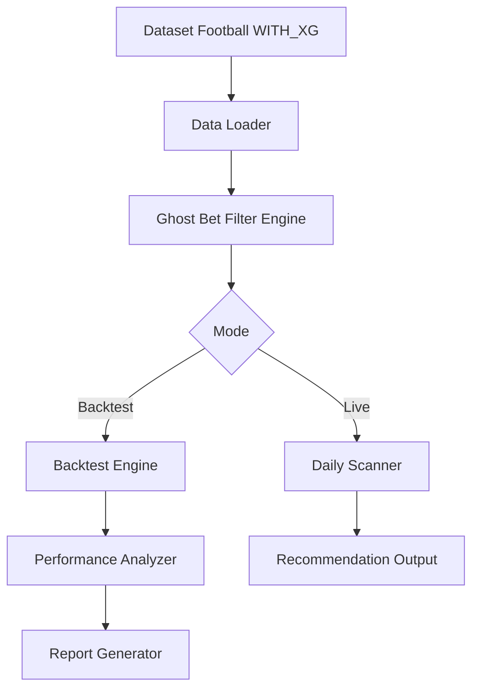

# Design Document - Ghost Bet Pan-Europe Strategy v3.0

## Overview

La stratégie Ghost Bet Pan-Europe v3.0 exploite un biais systématique du modèle xG calibré. Quand le modèle prédit une victoire écrasante (≥66.5%) pour l'équipe visiteuse, dans un match à faible xG total (≤2.78), avec une équipe à domicile en forme (goal diff ≥+1.2) face à un top 6, le marché sous-évalue massivement le nul à des cotes ≥5.05.

**Résultats vérifiés sur dataset WITH_XG (2007/08 – 2024/25):**
- Paris totaux: 237
- Strike rate: 26.6%
- Cote moyenne: 5.68
- ROI: +68.2%
- Profit total: +161.6 unités
- Max drawdown: –16.8 unités

**ROI par ligue:**
- Serie A (I1): +94%
- La Liga (SP1): +81%
- Premier League (E0): +59%
- Bundesliga (D1): +51%
- Ligue 1 (F1): +47%

## Architecture



## Components and Interfaces

### 1. GhostBetPanEuropeCriteria

```python
@dataclass
class GhostBetPanEuropeCriteria:
    min_away_prob: float = 0.665
    min_draw_odds: float = 5.05
    max_total_xg: float = 2.78
    min_home_goal_diff_last5: float = 1.20
    max_away_rank: int = 6
    allowed_leagues: List[str] = field(default_factory=lambda: [
        'E0', 'SP1', 'I1', 'D1', 'F1'  # EPL, LaLiga, SerieA, Bundesliga, Ligue1
    ])
```

### 2. GhostBetPanEuropeFilter

```python
class GhostBetPanEuropeFilter:
    def __init__(self, criteria: GhostBetPanEuropeCriteria):
        self.criteria = criteria
    
    def is_ghost_bet(self, match: pd.Series) -> bool:
        """Check if match qualifies as Ghost Bet Pan-Europe."""
        return (
            match['prob_final_away'] >= self.criteria.min_away_prob and
            match['odds_draw'] >= self.criteria.min_draw_odds and
            (match['xG_home'] + match['xG_away']) <= self.criteria.max_total_xg and
            match['home_goal_diff_last5'] >= self.criteria.min_home_goal_diff_last5 and
            match['away_league_rank'] <= self.criteria.max_away_rank and
            match['type'] in self.criteria.allowed_leagues
        )
    
    def filter_matches(self, df: pd.DataFrame) -> pd.DataFrame:
        """Filter all matches to Ghost Bet opportunities."""
        mask = (
            (df['prob_final_away'] >= self.criteria.min_away_prob) &
            (df['odds_draw'] >= self.criteria.min_draw_odds) &
            (df['xG_home'] + df['xG_away'] <= self.criteria.max_total_xg) &
            (df['home_goal_diff_last5'] >= self.criteria.min_home_goal_diff_last5) &
            (df['away_league_rank'] <= self.criteria.max_away_rank) &
            (df['type'].isin(self.criteria.allowed_leagues))
        )
        return df[mask].copy()
```

### 3. GhostBetBacktester

```python
@dataclass
class BacktestResult:
    total_bets: int
    wins: int
    losses: int
    total_staked: float
    total_profit: float
    roi: float
    strike_rate: float
    max_drawdown: float
    avg_odds: float
    equity_curve: List[float]
    bets_by_league: Dict[str, 'BacktestResult']
    bets_by_season: Dict[str, 'BacktestResult']

class GhostBetBacktester:
    def __init__(self, stake_pct: float = 0.01):
        self.stake_pct = stake_pct
    
    def run_backtest(self, ghost_bets: pd.DataFrame, initial_bankroll: float = 10000) -> BacktestResult:
        """Run backtest on Ghost Bet opportunities."""
        pass
    
    def calculate_profit(self, row: pd.Series) -> float:
        """Calculate profit for a single bet."""
        is_draw = row['score_home'] == row['score_away']
        return (row['odds_draw'] - 1) if is_draw else -1
```

### 4. DailyScanner

```python
class DailyScanner:
    def __init__(self, filter_engine: GhostBetPanEuropeFilter):
        self.filter = filter_engine
    
    def scan_upcoming(self, upcoming_matches: pd.DataFrame) -> pd.DataFrame:
        """Scan upcoming matches for Ghost Bet opportunities."""
        return self.filter.filter_matches(upcoming_matches)
    
    def format_recommendation(self, match: pd.Series) -> str:
        """Format opportunity for output."""
        pass
```

## Data Models

```python
# Required columns in dataset
REQUIRED_COLUMNS = [
    'date',
    'home',
    'away', 
    'type',  # league code
    'score_home',
    'score_away',
    'odds_draw',
    'prob_final_away',
    'xG_home',
    'xG_away',
    'home_goal_diff_last5',
    'away_league_rank'
]

@dataclass
class GhostBetOpportunity:
    date: str
    home: str
    away: str
    league: str
    odds_draw: float
    prob_final_away: float
    xG_home: float
    xG_away: float
    home_goal_diff_last5: float
    away_league_rank: int
    
@dataclass
class BetResult:
    opportunity: GhostBetOpportunity
    stake: float
    outcome: str  # 'win', 'loss'
    profit: float
```

## Correctness Properties

*A property is a characteristic or behavior that should hold true across all valid executions of a system-essentially, a formal statement about what the system should do. Properties serve as the bridge between human-readable specifications and machine-verifiable correctness guarantees.*

### Property 1: Ghost Bet Filter Completeness
*For any* match that passes the Ghost Bet filter, it SHALL satisfy ALL of the following conditions simultaneously:
- prob_final_away >= 0.665
- odds_draw >= 5.05
- (xG_home + xG_away) <= 2.78
- home_goal_diff_last5 >= 1.20
- away_league_rank <= 6
- type in ['E0', 'SP1', 'I1', 'D1', 'F1']

**Validates: Requirements 1.1, 1.2, 1.3, 2.2, 3.1, 4.1**

### Property 2: ROI Calculation Correctness
*For any* set of bet results, ROI SHALL equal (total_profit / total_staked) * 100, where total_profit = sum(individual_profits) and total_staked = sum(individual_stakes).

**Validates: Requirements 5.2**

### Property 3: Strike Rate Calculation Correctness
*For any* set of bet results, strike_rate SHALL equal wins / total_bets, where wins = count of bets where score_home == score_away.

**Validates: Requirements 5.2**

### Property 4: Equity Curve Consistency
*For any* backtest result, the final value of equity_curve SHALL equal initial_bankroll + total_profit, and equity_curve[i] - equity_curve[i-1] SHALL equal the profit of bet i.

**Validates: Requirements 5.3**

### Property 5: Breakdown Aggregation Consistency
*For any* backtest result, sum of profits across all leagues SHALL equal total_profit, and sum of profits across all seasons SHALL equal total_profit.

**Validates: Requirements 5.4**

### Property 6: Filter Determinism
*For any* input dataset, running the Ghost Bet filter twice SHALL produce identical output.

**Validates: Requirements 7.1**

### Property 7: Recommendation Completeness
*For any* Ghost Bet opportunity output, it SHALL contain: date, home, away, league, odds_draw, prob_final_away, xG_home, xG_away, home_goal_diff_last5, and away_league_rank.

**Validates: Requirements 6.2**

### Property 8: Profit Calculation Correctness
*For any* bet, profit SHALL equal (odds_draw - 1) if score_home == score_away, else -1.

**Validates: Requirements 5.2**

## Error Handling

| Error Condition | Handling Strategy |
|----------------|-------------------|
| Missing required column | Raise ValueError with column name |
| Missing odds_draw value | Exclude match from consideration |
| Missing prob_final_away | Exclude match from consideration |
| Missing xG values | Exclude match from consideration |
| Missing home_goal_diff_last5 | Exclude match from consideration |
| Missing away_league_rank | Exclude match from consideration |
| Invalid league code | Exclude match from consideration |
| Empty result set | Return empty DataFrame, no error |
| Division by zero (ROI calc) | Return 0.0 if total_staked = 0 |

## Testing Strategy

### Unit Tests
- Test individual filter conditions in isolation
- Test profit calculation with known outcomes
- Test metric calculations with hand-computed examples
- Test league code validation

### Property-Based Tests
The system will use `hypothesis` library for property-based testing.

Each property test will:
1. Generate random valid inputs using hypothesis strategies
2. Run the function under test
3. Verify the property holds
4. Run minimum 100 iterations per property

Property tests will be tagged with format: `**Feature: ghost-bet-strategy, Property {N}: {description}**`

### Integration Tests
- End-to-end backtest on sample historical data
- Verify filter + backtest pipeline produces consistent results
- Validate against known results (237 bets, +68.2% ROI)

