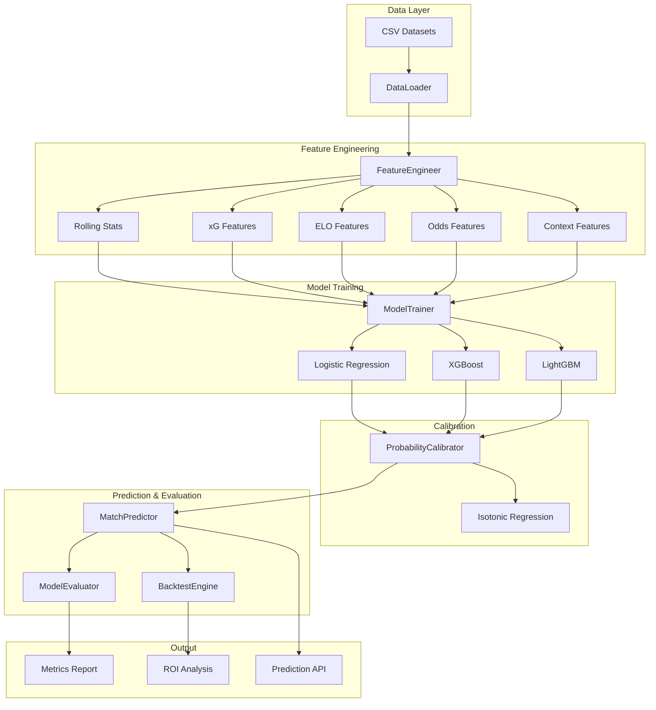

# Design Document - Predictive ML Model

## Overview

Ce système de modélisation prédictive utilise le machine learning pour prédire les résultats de matchs sportifs. Il exploite les données historiques enrichies (xG, ELO, cotes) pour générer des probabilités calibrées et identifier les opportunités de value betting.

L'architecture suit un pipeline modulaire : Feature Engineering → Model Training → Calibration → Prediction → Backtesting.

## Architecture



## Components and Interfaces

### 1. FeatureEngineer

```python
class FeatureEngineer:
    """Generates predictive features from raw match data."""
    
    def __init__(self, sport: str, window_sizes: List[int] = [5, 10, 20]):
        self.sport = sport
        self.window_sizes = window_sizes
    
    def compute_rolling_stats(self, df: pd.DataFrame, team: str) -> Dict[str, float]:
        """Calculate rolling statistics for a team."""
        pass
    
    def compute_xg_features(self, row: pd.Series) -> Dict[str, float]:
        """Extract xG-based features."""
        pass
    
    def compute_elo_features(self, row: pd.Series) -> Dict[str, float]:
        """Extract ELO-based features."""
        pass
    
    def compute_odds_features(self, row: pd.Series) -> Dict[str, float]:
        """Extract odds-derived features."""
        pass
    
    def compute_context_features(self, row: pd.Series, df: pd.DataFrame) -> Dict[str, float]:
        """Generate contextual features."""
        pass
    
    def generate_features(self, df: pd.DataFrame) -> pd.DataFrame:
        """Generate all features for a dataset."""
        pass
```

### 2. ModelTrainer

```python
class ModelTrainer:
    """Trains and tunes ML models for match prediction."""
    
    def __init__(self, sport: str, model_type: str = 'xgboost'):
        self.sport = sport
        self.model_type = model_type
        self.model = None
        self.calibrator = None
    
    def temporal_split(self, df: pd.DataFrame, test_ratio: float = 0.2) -> Tuple[pd.DataFrame, pd.DataFrame]:
        """Split data temporally (older = train, newer = test)."""
        pass
    
    def train(self, X_train: pd.DataFrame, y_train: pd.Series) -> None:
        """Train the model with hyperparameter tuning."""
        pass
    
    def calibrate(self, X_val: pd.DataFrame, y_val: pd.Series) -> None:
        """Calibrate probabilities using isotonic regression."""
        pass
    
    def save(self, path: str) -> None:
        """Save model with metadata."""
        pass
    
    def load(self, path: str) -> None:
        """Load model from file."""
        pass
```

### 3. ProbabilityCalibrator

```python
class ProbabilityCalibrator:
    """Calibrates raw model outputs to well-calibrated probabilities."""
    
    def __init__(self, method: str = 'isotonic'):
        self.method = method
        self.calibrators = {}  # One per class
    
    def fit(self, y_prob: np.ndarray, y_true: np.ndarray) -> None:
        """Fit calibration model."""
        pass
    
    def transform(self, y_prob: np.ndarray) -> np.ndarray:
        """Transform raw probabilities to calibrated ones."""
        pass
    
    def compute_brier_score(self, y_prob: np.ndarray, y_true: np.ndarray) -> float:
        """Compute Brier score for calibration quality."""
        pass
```

### 4. MatchPredictor

```python
class MatchPredictor:
    """Generates predictions for new matches."""
    
    def __init__(self, sport: str):
        self.sport = sport
        self.model = None
        self.feature_engineer = None
    
    def predict(self, home_team: str, away_team: str, date: str, 
                odds: Optional[Dict] = None) -> PredictionResult:
        """Generate prediction for a match."""
        pass
    
    def identify_value_bets(self, predictions: List[PredictionResult], 
                           threshold: float = 0.05) -> List[ValueBet]:
        """Identify value betting opportunities."""
        pass
```

### 5. BacktestEngine

```python
class BacktestEngine:
    """Simulates betting strategies on historical data."""
    
    def __init__(self, stake: float = 10.0, value_threshold: float = 0.05):
        self.stake = stake
        self.value_threshold = value_threshold
    
    def run(self, predictions: pd.DataFrame, actuals: pd.DataFrame) -> BacktestResult:
        """Run backtest simulation."""
        pass
    
    def compute_roi(self, bets: List[Bet]) -> float:
        """Calculate return on investment."""
        pass
    
    def compute_equity_curve(self, bets: List[Bet]) -> pd.Series:
        """Generate cumulative profit over time."""
        pass
    
    def bootstrap_confidence_interval(self, returns: np.ndarray, 
                                       n_samples: int = 1000) -> Tuple[float, float]:
        """Compute bootstrap CI for statistical significance."""
        pass
```

### 6. ModelEvaluator

```python
class ModelEvaluator:
    """Evaluates and compares model performance."""
    
    def __init__(self):
        self.metrics = {}
    
    def compute_classification_metrics(self, y_true: np.ndarray, 
                                        y_pred: np.ndarray) -> Dict[str, float]:
        """Compute accuracy, precision, recall, F1."""
        pass
    
    def compute_log_loss(self, y_true: np.ndarray, y_prob: np.ndarray) -> float:
        """Compute log loss for probability quality."""
        pass
    
    def compute_confusion_matrix(self, y_true: np.ndarray, 
                                  y_pred: np.ndarray) -> np.ndarray:
        """Generate confusion matrix."""
        pass
    
    def get_feature_importance(self, model, feature_names: List[str]) -> pd.DataFrame:
        """Extract feature importance from tree models."""
        pass
    
    def compare_models(self, results: Dict[str, Dict]) -> pd.DataFrame:
        """Generate comparison table."""
        pass
```

## Data Models

### PredictionResult

```python
@dataclass
class PredictionResult:
    match_id: str
    sport: str
    home_team: str
    away_team: str
    date: str
    probabilities: Dict[str, float]  # {'home': 0.45, 'draw': 0.28, 'away': 0.27}
    confidence_intervals: Dict[str, Tuple[float, float]]
    features_used: Dict[str, float]
    model_version: str
    is_value_bet: Dict[str, bool]  # Per outcome
```

### BacktestResult

```python
@dataclass
class BacktestResult:
    total_bets: int
    winning_bets: int
    total_stake: float
    total_profit: float
    roi_percent: float
    win_rate: float
    equity_curve: pd.Series
    confidence_interval: Tuple[float, float]
    by_sport: Dict[str, Dict]
    by_league: Dict[str, Dict]
    by_period: Dict[str, Dict]
```

### ModelMetadata

```python
@dataclass
class ModelMetadata:
    model_type: str
    sport: str
    training_date: str
    features: List[str]
    hyperparameters: Dict
    metrics: Dict[str, float]
    data_range: Tuple[str, str]  # (start_date, end_date)
```

## Correctness Properties

*A property is a characteristic or behavior that should hold true across all valid executions of a system-essentially, a formal statement about what the system should do. Properties serve as the bridge between human-readable specifications and machine-verifiable correctness guarantees.*

### Property 1: Probability Sum Constraint
*For any* prediction output, the sum of all outcome probabilities SHALL equal 1.0 (within floating-point tolerance of 0.001).
**Validates: Requirements 3.1**

### Property 2: Temporal Split Integrity
*For any* train/test split, all dates in the test set SHALL be strictly greater than all dates in the training set.
**Validates: Requirements 2.2**

### Property 3: Rolling Statistics Window Correctness
*For any* team and window size N, the rolling statistics SHALL be computed using exactly the N most recent games prior to the current match.
**Validates: Requirements 1.1**

### Property 4: xG Difference Arithmetic
*For any* match with xG values, xG_diff SHALL equal (xG_home - xG_away) within floating-point tolerance.
**Validates: Requirements 1.2**

### Property 5: Implied Probability Calculation
*For any* valid odds value > 1.0, implied probability SHALL equal 1/odds within floating-point tolerance.
**Validates: Requirements 1.4**

### Property 6: Brier Score Bounds
*For any* set of predictions and outcomes, Brier score SHALL be in range [0.0, 1.0].
**Validates: Requirements 3.3**

### Property 7: ROI Calculation Correctness
*For any* backtest result, ROI SHALL equal (total_profit / total_stake) * 100 within tolerance.
**Validates: Requirements 4.2**

### Property 8: Value Bet Threshold Consistency
*For any* identified value bet, the model probability SHALL exceed implied probability by at least the configured threshold.
**Validates: Requirements 4.3, 6.3**

### Property 9: Equity Curve Monotonic Calculation
*For any* equity curve, each point SHALL equal the cumulative sum of profits up to that bet.
**Validates: Requirements 4.5**

### Property 10: Log Loss Calculation
*For any* set of predictions, log loss SHALL equal -mean(y*log(p) + (1-y)*log(1-p)) within tolerance.
**Validates: Requirements 5.2**

### Property 11: Confusion Matrix Sum Integrity
*For any* confusion matrix, the sum of all cells SHALL equal the total number of predictions.
**Validates: Requirements 5.4**

### Property 12: Feature Importance Normalization
*For any* tree-based model, normalized feature importances SHALL sum to 1.0 within tolerance.
**Validates: Requirements 5.5**

### Property 13: Sport-Specific Outcome Count
*For any* Football prediction, output SHALL contain exactly 3 probabilities; for NBA/NHL/Tennis, exactly 2.
**Validates: Requirements 7.1, 7.2**

### Property 14: Confidence Interval Validity
*For any* confidence interval, lower bound SHALL be ≤ mean ≤ upper bound, and both bounds SHALL be in [0, 1].
**Validates: Requirements 6.2**

## Error Handling

| Error Type | Condition | Handling |
|------------|-----------|----------|
| `InsufficientDataError` | Team has < 5 historical games | Use league averages as fallback |
| `ModelNotFoundError` | Model file missing | Raise with path and recovery instructions |
| `InvalidOddsError` | Odds ≤ 1.0 or NULL | Skip odds features, log warning |
| `CalibrationWarning` | Brier score > 0.25 | Log warning, continue with uncalibrated |
| `DataLeakageError` | Test date ≤ train date | Raise immediately, abort training |

## Testing Strategy

### Property-Based Testing (Hypothesis)

Le système utilisera **Hypothesis** pour les tests property-based. Chaque propriété de correction sera implémentée comme un test PBT.

Configuration minimale : 100 itérations par test.

Format des annotations :
```python
# **Feature: predictive-ml-model, Property 1: Probability Sum Constraint**
@given(st.lists(st.floats(min_value=0.01, max_value=0.99), min_size=2, max_size=3))
def test_probability_sum_constraint(probabilities):
    ...
```

### Unit Tests

- Test de chaque composant individuellement
- Tests des edge cases (équipes nouvelles, données manquantes)
- Tests d'intégration du pipeline complet

### Backtesting Validation

- Validation sur données out-of-sample (2024-2025)
- Comparaison avec baseline (bookmaker implied probabilities)
- Tests de robustesse avec différents seuils de value

