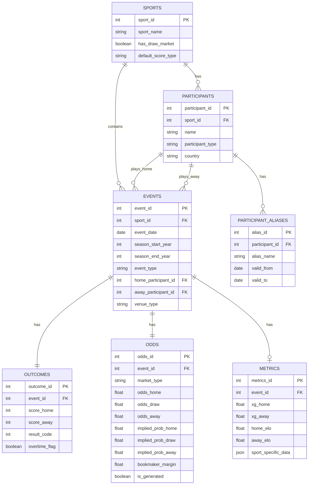

# Design Document: Sports Data Warehouse

## Overview

This design document describes the architecture and implementation of a normalized sports data warehouse for multi-sport betting analytics and machine learning. The system transforms raw CSV data from 4 sports (Football, NBA, NHL, Tennis) into a star schema optimized for analytical queries and predictive modeling.

### Current Data Analysis

| Sport | Records | Date Range | Participants | Key Issues |
|-------|---------|------------|--------------|------------|
| Football | 35,331 | 2005-2025 | 206 teams | 100% missing xG, 0.02% missing odds |
| NBA | 23,118 | 2007-2025 | 30 teams | 100% missing xG |
| NHL | 18,616 | 2007-2022 | 34 teams | Complete |
| Tennis | 50,907 | 2007-2024 | 1,589 players | 100% missing xG, 8 duplicates |
| **Total** | **127,972** | **20 years** | **1,859 unique** | |

## Architecture

The system follows a modular ETL (Extract-Transform-Load) architecture with clear separation of concerns:

```
┌─────────────────────────────────────────────────────────────────┐
│                        ETL Pipeline                              │
├─────────────────────────────────────────────────────────────────┤
│  ┌──────────┐    ┌──────────────┐    ┌──────────────┐          │
│  │  Extract │───▶│  Transform   │───▶│    Load      │          │
│  │  (CSV)   │    │  (Clean/Norm)│    │ (SQLite/Parq)│          │
│  └──────────┘    └──────────────┘    └──────────────┘          │
│       │                │                    │                   │
│       ▼                ▼                    ▼                   │
│  ┌──────────┐    ┌──────────────┐    ┌──────────────┐          │
│  │ Validator│    │ Quality      │    │ Schema       │          │
│  │          │    │ Reporter     │    │ Manager      │          │
│  └──────────┘    └──────────────┘    └──────────────┘          │
└─────────────────────────────────────────────────────────────────┘
```

## Components and Interfaces

### 1. DataLoader

Responsible for reading raw CSV files and initial parsing.

```python
class DataLoader:
    def load_csv(self, file_path: str) -> pd.DataFrame:
        """Load a single CSV file with date parsing."""
        
    def load_all_sports(self, dataset_dir: str) -> Dict[str, pd.DataFrame]:
        """Load all sport CSV files from directory."""
        
    def validate_schema(self, df: pd.DataFrame, sport: str) -> ValidationResult:
        """Validate required columns exist for sport."""
```

### 2. DataCleaner

Handles data cleaning and normalization.

```python
class DataCleaner:
    def normalize_names(self, df: pd.DataFrame, columns: List[str]) -> pd.DataFrame:
        """Trim whitespace and standardize encoding."""
        
    def validate_odds(self, df: pd.DataFrame) -> pd.DataFrame:
        """Set invalid odds (outside 1.01-1000) to NULL."""
        
    def validate_scores(self, df: pd.DataFrame) -> pd.DataFrame:
        """Set negative scores to NULL."""
        
    def parse_season(self, season: int) -> Tuple[int, int]:
        """Extract start_year and end_year from season code."""
        
    def deduplicate(self, df: pd.DataFrame) -> Tuple[pd.DataFrame, int]:
        """Remove duplicates, return cleaned df and count removed."""
```

### 3. SchemaManager

Manages the normalized star schema.

```python
class SchemaManager:
    def create_tables(self, engine: Engine) -> None:
        """Create all normalized tables with constraints."""
        
    def get_or_create_participant(self, name: str, sport_id: int) -> int:
        """Get existing participant_id or create new one."""
        
    def insert_event(self, event_data: Dict) -> int:
        """Insert event and return event_id."""
```

### 4. DataExporter

Handles export to multiple formats.

```python
class DataExporter:
    def export_sqlite(self, output_path: str) -> None:
        """Export all tables to SQLite database."""
        
    def export_parquet(self, output_dir: str) -> None:
        """Export to partitioned Parquet files."""
        
    def validate_export(self) -> ValidationResult:
        """Verify row counts match source."""
```

### 5. QualityReporter

Generates data quality reports.

```python
class QualityReporter:
    def analyze_missing(self, df: pd.DataFrame) -> Dict[str, float]:
        """Calculate missing value percentages per column."""
        
    def detect_outliers(self, df: pd.DataFrame, columns: List[str]) -> Dict:
        """Detect outliers using IQR method."""
        
    def generate_report(self, format: str = 'json') -> str:
        """Generate full quality report in specified format."""
```

## Data Models

### Entity-Relationship Diagram



### Table Definitions

#### sports
| Column | Type | Constraints | Description |
|--------|------|-------------|-------------|
| sport_id | INTEGER | PRIMARY KEY | Auto-increment ID |
| sport_name | VARCHAR(50) | NOT NULL, UNIQUE | Football, NBA, NHL, Tennis |
| has_draw_market | BOOLEAN | NOT NULL | True for Football only |
| default_score_type | VARCHAR(20) | NOT NULL | goals, points, sets |

#### participants
| Column | Type | Constraints | Description |
|--------|------|-------------|-------------|
| participant_id | INTEGER | PRIMARY KEY | Auto-increment ID |
| sport_id | INTEGER | FOREIGN KEY | Reference to sports |
| name | VARCHAR(100) | NOT NULL | Normalized name |
| participant_type | VARCHAR(10) | NOT NULL | 'team' or 'player' |
| country | VARCHAR(50) | NULLABLE | Country/region |

#### events
| Column | Type | Constraints | Description |
|--------|------|-------------|-------------|
| event_id | INTEGER | PRIMARY KEY | Auto-increment ID |
| sport_id | INTEGER | FOREIGN KEY | Reference to sports |
| event_date | DATE | NOT NULL | Match date |
| season_start_year | INTEGER | NOT NULL | e.g., 2019 |
| season_end_year | INTEGER | NOT NULL | e.g., 2020 |
| event_type | VARCHAR(20) | NOT NULL | League/surface/type |
| home_participant_id | INTEGER | FOREIGN KEY | Home team/player |
| away_participant_id | INTEGER | FOREIGN KEY | Away team/player |
| venue_type | VARCHAR(10) | DEFAULT 'neutral' | home/away/neutral |

#### outcomes
| Column | Type | Constraints | Description |
|--------|------|-------------|-------------|
| outcome_id | INTEGER | PRIMARY KEY | Auto-increment ID |
| event_id | INTEGER | FOREIGN KEY, UNIQUE | One outcome per event |
| score_home | INTEGER | NULLABLE | Home score |
| score_away | INTEGER | NULLABLE | Away score |
| result_code | INTEGER | NOT NULL | 0=away, 1=home, 2=draw |
| overtime_flag | BOOLEAN | DEFAULT FALSE | Went to OT/extra time |

#### odds
| Column | Type | Constraints | Description |
|--------|------|-------------|-------------|
| odds_id | INTEGER | PRIMARY KEY | Auto-increment ID |
| event_id | INTEGER | FOREIGN KEY | Reference to events |
| market_type | VARCHAR(20) | NOT NULL | 'moneyline', 'final' |
| odds_home | FLOAT | NULLABLE | Home win odds |
| odds_draw | FLOAT | NULLABLE | Draw odds (Football) |
| odds_away | FLOAT | NULLABLE | Away win odds |
| implied_prob_home | FLOAT | NULLABLE | 1/odds_home |
| implied_prob_draw | FLOAT | NULLABLE | 1/odds_draw |
| implied_prob_away | FLOAT | NULLABLE | 1/odds_away |
| bookmaker_margin | FLOAT | NULLABLE | Sum of probs - 1 |
| is_generated | BOOLEAN | DEFAULT FALSE | True if model-generated |

#### metrics
| Column | Type | Constraints | Description |
|--------|------|-------------|-------------|
| metrics_id | INTEGER | PRIMARY KEY | Auto-increment ID |
| event_id | INTEGER | FOREIGN KEY, UNIQUE | One metrics row per event |
| xg_home | FLOAT | NULLABLE | Expected goals home |
| xg_away | FLOAT | NULLABLE | Expected goals away |
| home_elo | FLOAT | NULLABLE | Home ELO rating |
| away_elo | FLOAT | NULLABLE | Away ELO rating |
| sport_specific_data | JSON | NULLABLE | Sport-specific metrics |

### Sport-Specific JSON Schema (metrics.sport_specific_data)

**Football:**
```json
{
  "predicted_score": "1-1",
  "prob_predicted_score": 0.124,
  "prob_elo_home": 0.45,
  "prob_elo_draw": 0.28,
  "prob_elo_away": 0.27,
  "prob_elo_cal_home": 0.46,
  "prob_elo_cal_draw": 0.27,
  "prob_elo_cal_away": 0.27,
  "prob_poisson_home": 0.44,
  "prob_poisson_draw": 0.29,
  "prob_poisson_away": 0.27,
  "prob_final_home": 0.45,
  "prob_final_draw": 0.28,
  "prob_final_away": 0.27
}
```

**NBA:**
```json
{
  "home_elo": 1580.5,
  "away_elo": 1520.3
}
```

## Correctness Properties

*A property is a characteristic or behavior that should hold true across all valid executions of a system-essentially, a formal statement about what the system should do. Properties serve as the bridge between human-readable specifications and machine-verifiable correctness guarantees.*

### Property 1: Date Parsing Consistency
*For any* valid ISO 8601 date string in a CSV file, parsing and formatting back to string should produce the original date string.
**Validates: Requirements 1.1**

### Property 2: Record Count Preservation
*For any* CSV file loaded, the reported record count should equal the actual number of valid rows loaded (excluding malformed rows).
**Validates: Requirements 1.3**

### Property 3: Duplicate Deduplication Correctness
*For any* dataset with duplicate events (same date, home, away, sport), after deduplication the count of remaining records plus the count of removed duplicates should equal the original count.
**Validates: Requirements 1.5**

### Property 4: Name Normalization Idempotence
*For any* participant name, applying normalization twice should produce the same result as applying it once.
**Validates: Requirements 2.1**

### Property 5: Odds Validation Boundary
*For any* odds value, if it is within [1.01, 1000.0] it should be preserved; if outside this range it should become NULL.
**Validates: Requirements 2.3**

### Property 6: Season Parsing Correctness
*For any* valid season code (e.g., 20192020), extracting start_year and end_year and recombining should produce the original code.
**Validates: Requirements 2.5**

### Property 7: Export Row Count Integrity
*For any* dataset exported to SQLite or Parquet, the row count in the destination should equal the row count in the source.
**Validates: Requirements 4.3**

### Property 8: Serialization Round-Trip
*For any* valid event data, serializing to Parquet and deserializing should produce an equivalent data structure.
**Validates: Requirements 4.5**

### Property 9: Implied Probability Calculation
*For any* valid odds value o, the implied probability should equal 1/o (within floating-point tolerance).
**Validates: Requirements 6.1**

### Property 10: Bookmaker Margin Calculation
*For any* set of odds (home, draw, away), the bookmaker margin should equal (1/odds_home + 1/odds_draw + 1/odds_away - 1) for 3-way markets, or (1/odds_home + 1/odds_away - 1) for 2-way markets.
**Validates: Requirements 6.2**

### Property 11: Sport Filter Isolation
*For any* sport_id filter applied to the events table, all returned events should have that exact sport_id.
**Validates: Requirements 7.3**

### Property 12: Missing Value Report Accuracy
*For any* dataset, the reported missing value percentage for a column should equal (count of NULLs / total rows) * 100.
**Validates: Requirements 5.1**

### Property 13: Outlier Detection Consistency
*For any* numeric column, values flagged as outliers should be outside the range [Q1 - 1.5*IQR, Q3 + 1.5*IQR].
**Validates: Requirements 5.2**

## Error Handling

### Loading Errors
- **Malformed CSV rows**: Log error with row number, skip row, continue processing
- **Missing required columns**: Raise `SchemaValidationError` with column name and file path
- **File not found**: Raise `FileNotFoundError` with full path

### Validation Errors
- **Invalid odds**: Set to NULL, log warning with event details
- **Invalid dates**: Flag record as invalid, exclude from processing
- **Negative scores**: Set to NULL, log warning
- **Invalid season format**: Attempt parsing, set to NULL if fails

### Export Errors
- **Disk full**: Raise `IOError`, rollback partial writes
- **Permission denied**: Raise `PermissionError` with path
- **Row count mismatch**: Raise `DataIntegrityError` with counts

## Testing Strategy

### Unit Testing Framework
- **Framework**: pytest
- **Location**: `tests/test_etl/`
- **Coverage target**: >80%

Unit tests will cover:
- Individual component methods (DataLoader, DataCleaner, etc.)
- Edge cases (empty files, single row, maximum values)
- Error conditions (missing columns, invalid data)

### Property-Based Testing Framework
- **Framework**: Hypothesis (Python)
- **Configuration**: Minimum 100 iterations per property
- **Location**: `tests/test_properties/`

Each correctness property will be implemented as a property-based test:
- Generate random valid inputs using Hypothesis strategies
- Verify the property holds for all generated inputs
- Tag each test with the property number and requirement reference

Example test annotation:
```python
@given(st.dates(min_value=date(2005, 1, 1), max_value=date.today()))
def test_date_parsing_roundtrip(date_val):
    """
    **Feature: sports-data-warehouse, Property 1: Date Parsing Consistency**
    **Validates: Requirements 1.1**
    """
    date_str = date_val.isoformat()
    parsed = parse_date(date_str)
    assert parsed.isoformat() == date_str
```

### Integration Tests
- End-to-end pipeline tests with sample data
- Export format validation
- Foreign key constraint verification

## Feature Engineering Ideas

### Derived Features (Post-Implementation)

1. **Value Bet Detection**
   - `value_home = estimated_prob_home - implied_prob_home`
   - Flag when value > threshold (e.g., 5%)

2. **Rolling Form Statistics**
   - Last N games: win rate, avg score, avg goals conceded
   - Weighted by recency (exponential decay)

3. **Head-to-Head History**
   - Historical win rate between specific participants
   - Average goal difference in H2H matches

4. **Home Advantage Metrics**
   - Team-specific home win rate vs league average
   - Home advantage by league/competition

5. **Odds Movement Features**
   - Difference between opening and closing odds
   - Implied probability shift

6. **ELO-Based Features**
   - ELO difference (home - away)
   - ELO momentum (change over last N games)

7. **Surface/Venue Features (Tennis)**
   - Player win rate by surface
   - Surface-specific ELO

8. **Seasonal Features**
   - Month/week of season
   - Days since season start
   - Fixture congestion (games in last 7 days)
