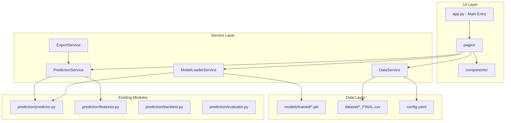

# Design Document - Streamlit Prediction App

## Overview

Cette application Streamlit transforme le prototype existant en un outil de prédiction live professionnel. Elle intègre le modèle ML entraîné (LightGBM + calibration Platt/Isotonic), les générateurs xG, et le système de backtesting pour fournir des prédictions calibrées avec identification automatique des value bets.

L'architecture suit un pattern MVC adapté à Streamlit : Pages (Views) → Services (Controllers) → Data/Models.

## Architecture



## Components and Interfaces

### 1. Project Structure

```
smartbet/
├── app.py                      # Main Streamlit entry point
├── pages/
│   ├── __init__.py
│   ├── 1_📊_Live_Predictions.py
│   ├── 2_📈_Performance.py
│   ├── 3_🎯_Value_Bets.py
│   ├── 4_📉_Analysis.py
│   └── 5_⚙️_Settings.py
├── components/
│   ├── __init__.py
│   ├── match_card.py           # Match display component
│   ├── probability_display.py  # Probability visualization
│   ├── value_bet_table.py      # Value bet highlighting table
│   ├── xg_chart.py             # xG trend charts
│   ├── equity_curve.py         # Performance equity curve
│   └── filters.py              # Advanced filter sidebar
├── services/
│   ├── __init__.py
│   ├── model_loader.py         # Model loading and caching
│   ├── prediction_service.py   # Prediction generation
│   ├── data_service.py         # Data loading and caching
│   └── export_service.py       # CSV/JSON export
├── utils/
│   ├── __init__.py
│   ├── config.py               # Configuration management
│   ├── styling.py              # CSS and theming
│   └── helpers.py              # Utility functions
└── streamlit_config/
    └── config.toml             # Streamlit configuration
```

### 2. ModelLoaderService

```python
class ModelLoaderService:
    """Loads and manages trained ML models."""
    
    def __init__(self, models_dir: str = "models/trained"):
        self.models_dir = Path(models_dir)
        self._models: Dict[str, Any] = {}
        self._metadata: Dict[str, ModelMetadata] = {}
    
    def get_latest_model(self, sport: str) -> Optional[Any]:
        """Get the most recent trained model for a sport."""
        pass
    
    def get_model_metadata(self, sport: str) -> Optional[ModelMetadata]:
        """Get metadata for the loaded model."""
        pass
    
    def list_available_models(self) -> Dict[str, List[str]]:
        """List all available models by sport."""
        pass
    
    def is_model_available(self, sport: str) -> bool:
        """Check if a model is available for a sport."""
        pass
```

### 3. PredictionService

```python
class PredictionService:
    """Generates predictions using loaded models."""
    
    def __init__(self, model_loader: ModelLoaderService):
        self.model_loader = model_loader
        self._predictors: Dict[str, MatchPredictor] = {}
    
    def predict_match(self, sport: str, home_team: str, away_team: str,
                      odds: Optional[Dict] = None) -> PredictionResult:
        """Generate prediction for a single match."""
        pass
    
    def predict_batch(self, matches: List[Dict]) -> List[PredictionResult]:
        """Generate predictions for multiple matches."""
        pass
    
    def identify_value_bets(self, predictions: List[PredictionResult],
                           threshold: float = 0.05) -> List[ValueBet]:
        """Identify value betting opportunities."""
        pass
    
    def calculate_fair_odds(self, probabilities: Dict[str, float]) -> Dict[str, float]:
        """Calculate fair odds from probabilities."""
        pass
```

### 4. DataService

```python
class DataService:
    """Manages data loading and caching."""
    
    def __init__(self, data_dir: str = "dataset"):
        self.data_dir = Path(data_dir)
    
    @st.cache_data
    def load_sport_data(self, sport: str) -> pd.DataFrame:
        """Load historical data for a sport."""
        pass
    
    def get_recent_matches(self, sport: str, days: int = 7) -> pd.DataFrame:
        """Get recent matches for analysis."""
        pass
    
    def get_team_form(self, sport: str, team: str, n_games: int = 10) -> Dict:
        """Get team form and xG statistics."""
        pass
    
    def get_upcoming_matches(self, sport: str) -> pd.DataFrame:
        """Get matches for today and tomorrow."""
        pass
```

### 5. Components

#### MatchCard Component
```python
def render_match_card(
    match: Dict,
    prediction: PredictionResult,
    show_xg: bool = True,
    show_form: bool = True
) -> None:
    """Render a match card with prediction details."""
    pass
```

#### ValueBetTable Component
```python
def render_value_bet_table(
    value_bets: List[ValueBet],
    highlight_threshold: float = 0.05,
    show_kelly: bool = True
) -> None:
    """Render a table of value bets with highlighting."""
    pass
```

#### XGChart Component
```python
def render_xg_chart(
    team: str,
    xg_data: pd.DataFrame,
    window: int = 10
) -> None:
    """Render xG trend chart for a team."""
    pass
```

## Data Models

### ValueBet
```python
@dataclass
class ValueBet:
    match_id: str
    sport: str
    home_team: str
    away_team: str
    date: str
    outcome: str  # 'home', 'draw', 'away'
    model_probability: float
    implied_probability: float
    edge: float  # model_prob - implied_prob
    bookmaker_odds: float
    fair_odds: float
    kelly_fraction: float
    confidence_interval: Tuple[float, float]
```

### AppConfig
```python
@dataclass
class AppConfig:
    default_edge_threshold: float = 0.05
    default_min_odds: float = 1.20
    default_max_odds: float = 5.00
    kelly_fraction_cap: float = 0.25
    cache_ttl_seconds: int = 300
    theme: str = 'light'  # 'light' or 'dark'
```

## Correctness Properties

*A property is a characteristic or behavior that should hold true across all valid executions of a system-essentially, a formal statement about what the system should do. Properties serve as the bridge between human-readable specifications and machine-verifiable correctness guarantees.*

### Property 1: Fair Odds Calculation
*For any* probability p in (0, 1), fair odds SHALL equal 1/p within floating-point tolerance.
**Validates: Requirements 4.2**

### Property 2: Value Bet Edge Calculation
*For any* value bet, edge SHALL equal (model_probability - implied_probability) within tolerance.
**Validates: Requirements 5.1**

### Property 3: Probability Normalization
*For any* set of outcome probabilities displayed, the sum SHALL equal 1.0 within tolerance of 0.001.
**Validates: Requirements 4.3**

### Property 4: Kelly Fraction Bounds
*For any* calculated Kelly fraction, the value SHALL be in range [0, kelly_fraction_cap].
**Validates: Requirements 5.4**

### Property 5: Model Loading Consistency
*For any* sport with available model, loading the model twice SHALL return equivalent predictions.
**Validates: Requirements 2.1**

### Property 6: Export Data Completeness
*For any* exported CSV, all required columns (match, probabilities, odds, edge) SHALL be present.
**Validates: Requirements 10.2**

### Property 7: Filter Application
*For any* filter criteria, all displayed matches SHALL satisfy the filter conditions.
**Validates: Requirements 9.1, 9.2, 9.3, 9.4**

### Property 8: Date Range Validity
*For any* displayed match on Live Predictions page, the match date SHALL be today or tomorrow.
**Validates: Requirements 3.1**

## Error Handling

| Error Type | Condition | Handling |
|------------|-----------|----------|
| `ModelNotFoundError` | No model file for sport | Display warning, disable sport predictions |
| `DataLoadError` | CSV file missing or corrupt | Display error, suggest data refresh |
| `PredictionError` | Model fails to predict | Log error, show fallback message |
| `ExportError` | Export fails | Display error with retry option |
| `ConfigError` | Invalid configuration | Use defaults, log warning |

## Testing Strategy

### Property-Based Testing (Hypothesis)

Le système utilisera **Hypothesis** pour les tests property-based des calculs critiques.

Configuration minimale : 100 itérations par test.

Format des annotations :
```python
# **Feature: streamlit-prediction-app, Property 1: Fair Odds Calculation**
@given(st.floats(min_value=0.01, max_value=0.99))
def test_fair_odds_calculation(probability):
    ...
```

### Unit Tests

- Test des services individuellement (ModelLoader, PredictionService, DataService)
- Test des composants UI avec données mock
- Test des fonctions utilitaires

### Integration Tests

- Test du chargement complet de l'application
- Test du flux prediction → value bet → export
- Test de la cohérence entre pages

### UI Tests (Optional)

- Tests Playwright pour les interactions utilisateur
- Vérification du rendu des composants
